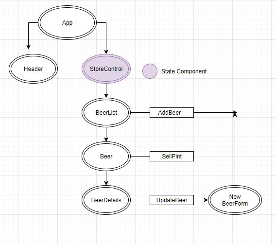

<center>

# **Taproom**
Project Initiated: 12-02-2021
Updated: 12-02-2021

## **Project Description**

This phase one of a two-week project that I created to help further my knowledge with ReactJS fundamentals and components. This one-page application was created so the user could keep an inventory off all the beers they have on tap and a place to store that beer's information. Below you will find a number of user stories to better describe the features of this application.


| ID | User Story | Accepted |
|---------|-----------|--------|
| US01 | "As a user, I want to see a list of all available beers. For each beer, I want to see its name, brand, price, pints, and alcohol content."| True |
| US02 | "As the user, I want to submit a form to add a new beer to the beer list."| True |
| US03 | "As the user, I want to be able to click on a beer to see it's detail page." | True |
| US04 | "As the user, I want to see how many pints are left in a keg." | True |
| US05 | "As the user, I want to be able to click a button to 'buy' a pint whenever one is sold. This should decrease the number of pints left by 1. Pints should not be able to go below 0." | True |

## Component Tree Diagram



</center>

### **Install/Setup Project** ###

**Option 1** (download zip file)
1) Copy and paste the following GitHub project link into your web browser's url bar and hit enter/return. https://github.com/Sarahgilbert064/Taproom.git
2) Download a .zip copy the repository by clicking on the large green "Code" button near the upper right corner of the screen.
3) Right click the .zip file and extract(unzip) it's contents.
4) Open your computer's terminal/console, and navigate to folder called "__taproom__". 


**Option 2** (via git console/terminal)
1) Open your Git enabled terminal/console and navigate to a directory that you wish to download this project to.
2) Type the following line of code into your terminal/console to automatically download the project to your current direcory and hit return/enter

    <code>git clone https://github.com/SarahGilbert064/Taproom.git</code>

3) Once the project has finished downloading, use the terminal/console to navigate to the "__Taproom__" folder of the project.


## Available Scripts

In the project directory, you can run:

### `npm install`

This will install all dependencies needed for this application.

### `npm run build`

Builds the app for production to the `build` folder.\
It correctly bundles React in production mode and optimizes the build for the best performance.

The build is minified and the filenames include the hashes.\
Your app is ready to be deployed!

See the section about [deployment](https://facebook.github.io/create-react-app/docs/deployment) for more information.

### `npm start`

Runs the app in the development mode.\
Open [http://localhost:3000](http://localhost:3000) to view it in the browser.

## **Known Bugs**
There are no known bugs

## **Technology Used**
* ReactJS
* JavaScript
* Git
* Visual Studio Code
* CSS
* HMTL

  
------------------------------
## 👥 Contributors

| Author | Email |
|--------|:-----:|
| [Sarah Gilbert](https://www.linkedin.com/in/sarahgilbertpdx/) | [sarahgilbert064@gmail.com](mailto:sarahgilbert064@gmail.com) |
------------------------------

## 📝 Legal
```
MIT License

Copyright (c) 2021 Sarah Gilbert

Permission is hereby granted, free of charge, to any person obtaining a copy of this software and associated documentation files (the "Software"), to deal in the Software without restriction, including without limitation the rights to use, copy, modify, merge, publish, distribute, sublicense, and/or sell copies of the Software, and to permit persons to whom the Software is furnished to do so, subject to the following conditions:

The above copyright notice and this permission notice shall be included in all copies or substantial portions of the Software.

THE SOFTWARE IS PROVIDED "AS IS", WITHOUT WARRANTY OF ANY KIND, EXPRESS OR IMPLIED, INCLUDING BUT NOT LIMITED TO THE WARRANTIES OF MERCHANTABILITY, FITNESS FOR A PARTICULAR PURPOSE AND NONINFRINGEMENT. IN NO EVENT SHALL THE AUTHORS OR COPYRIGHT HOLDERS BE LIABLE FOR ANY CLAIM, DAMAGES OR OTHER LIABILITY, WHETHER IN AN ACTION OF CONTRACT, TORT OR OTHERWISE, ARISING FROM, OUT OF OR IN CONNECTION WITH THE SOFTWARE OR THE USE OR OTHER DEALINGS IN THE SOFTWARE.
```
<center><a href="#">Return to Top</a></center>


